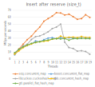

# Concurrent map
Starting version 1.2, the *seq* library provides the unordered associative containers `seq::concurrent_map` and `seq::concurrent_set` dedicated to high-load concurrent scenarios (header: `<seq/concurrent_map.hpp>`). 

There already exist several C++ implementations of concurrent hash tables like (non exhaustive list) [`gtl::parallel_flat_hash_map`](https://github.com/greg7mdp/gtl/blob/main/docs/phmap.md), [`libcuckoo::cuckoohash_map`](https://github.com/efficient/libcuckoo/tree/master), [`tbb::concurrent_hash_map`](https://oneapi-src.github.io/oneTBB/main/tbb_userguide/concurrent_hash_map.html), [`tbb::concurrent_unordered_map`](https://spec.oneapi.io/versions/1.1-provisional-rev-2/elements/oneTBB/source/containers/concurrent_unordered_map_cls.html), [`folly::ConcurrentHashMap`](https://github.com/facebook/folly/blob/main/folly/concurrency/ConcurrentHashMap.h) and the newest [`boost::concurrent_flat_map`](https://www.boost.org/doc/libs/develop/libs/unordered/doc/html/unordered.html). The [note](https://bannalia.blogspot.com/2023/07/inside-boostconcurrentflatmap.html) describing `boost::concurrent_flat_map` provides a very good summary of the different techniques used to achieve parallelism with hash tables.

`seq::concurrent_map` uses a combination of described techniques as well as additional innovations to achieve a high concurrency level scaling with the number of available CPU cores. 

## High level description
On a high level point of view, `seq::concurrent_map` relies on the following mechanisms:

-	It uses *Sharding*: the hashmap  is divided into a fixed (but configurable) number of submaps indexed by the hash value.
-	Each *shard* (or submap) is a Swiss table similar to [`boost::unordered_flat_map`](https://www.boost.org/doc/libs/1_83_0/libs/unordered/doc/html/unordered.html) or [`absl::flat_hash_map`](https://abseil.io/docs/cpp/guides/container), except that it uses chaining instead of the more traditional quadratic probing (the reason is explained after). This allows load factors greater than 1, and removes the need of tombstones when erasing elements.
-	Each bucket within a submap can contain up to 15 elements. An array of *metadata* is maintained separatly and contains a reduced hash representation of one byte per element to allow efficient SIMD-based  lookups.
-	Each bucket contains an additional pointer to the next *chained* node (of up to 15 elements) in case of bucket overflow.
-	Fine grained locking is obtained by associating a read-write spinlock to each bucket. This spinlock covers the bucket itself as well as potential chained nodes.

So far, this looks like a combination of `gtl::parallel_flat_hash_map` (Sharding) and `boost::concurrent_flat_map` (fine grained locking). However, both tables use a global lock mechanism associated to the table (or to a *shard* for `gtl`):

-	For `gtl::parallel_flat_hash_map`, the global lock is acquired in read or write mode for all operations on the submap: insert (write), erase (write), lookup (read or write). This very quickly reduces the concurrency level of the hash table, even for a high Sharding factor.
-	For `boost::concurrent_flat_map`, the lock is acquired in read mode for all operations, and in write mode only when the full table is involved (rehashing, comparison...). Buckets read-write locks are acquired only when related buckets are inspected/modified, which allows better scaling with the number of threads.

This global lock is what hurts concurrent scaling the most, even when acquired in read-only mode. Every single lock contention badly hurts performances, and even simple atomic operations can introduce cache line contention.

`seq::concurrent_map` tries to alleviate this issue by... simply removing the need of a global lock mechanism. The next section describes the functional of a single submap and its internal locking scheme.

## Submap locking scheme
`seq::concurrent_map` only provides one read-write spinlock per bucket that covers the bucket itself (up to 15 elements) and the chained nodes (up to 15 elements per node). 

For each insert, erase or lookup operation, the strategy is the following:

- The  bucket index is computed based on the hash value using a shift operation (the table uses a power of 2 growth policy)
- The bucket lock is aquired in either read (const lookup) or write mode (non const lookup, insert, erase). Only one lock per operation is acquired as no probing happens.
- The bucket lock is released at the end of operation.

So far so good, but what happens during a rehash? Well, the rehash process will visit each bucket (and associated chained nodes) and lock each bucket in write mode before relocating elements into the new buckets. The bucket locks **are not released until the end of the rehash process.** Note that freeing the old bucket array, affecting the new bucket array, and updating the hash mask are all performed when all bucket locks are acquired. At the very end of the rehash process, all locks are released.

Therefore, when performing a lookup, insert or erase operation while rehash is in process, 2 things might happen:

-	The bucket lock can be acquired, as the rehash process did not already reach this bucket. The operation can be performed correctly. Which means, for instance, **that we can still insert new values during rehash**. This is why chaining is used instead of quadratic probing: inserting values during rehash will potentially (and most certainly) increase the load factor above 1.
-	The bucket lock is already acquired as the rehash process already visited this bucket. No choice but to wait for the full rehash to finish, and retry the operation with the new bucket array.

This method effectively removes the need of a global locking mechanism to handle rehashing. But we still have one issue: where do we store the read-white spinlocks associated to each bucket?

We cannot store them in the buckets themselves: the old buckets (and locks) will be destroyed in the rehash process, while other threads are still spinning on these locks.

We could store them in a dedicated array of locks with the same size of the bucket array. But likewise this array of locks needs to grow or shrink during rehash. And we might end-up destroying the lock array while other threads are spinning on these locks.

Therefore we need a **thread-safe, random-access, reference stable array of read-write spinlocks** (ouch). The thread-safety cannot be based on a global locking mechanism, or we would  be back to square one. The selected approach is a bucket based array with a growth policy of 2 and **that can only grow**. The code of this array-like class is pretty short and a simplified version is given bellow:

```cpp
template<class Lock, class Allocator = std::allocator<Lock> >
class SharedLockArray : private Allocator
{
	template< class U>
	using rebind_alloc = typename std::allocator_traits<Allocator>::template rebind_alloc<U>;
	using lock_type = Lock;

	// Store ahead of time 32 arrays of lock objects.
	// Each array has a size which is a power of 2 : size = (1 << array_index)
	std::atomic<lock_type*> arrays[32];

	// Allocate/initialize the array for given index (between 0 and 31)
	lock_type* make_array(size_t index) 
	{
		lock_type* l = arrays[index].load(std::memory_order_relaxed);
		if (l) 
			return l; // array already existing: return it

		// allocate and initialize array
		rebind_alloc<lock_type> al = *this;
		l = al.allocate(1ull << index);
		memset(static_cast<void*>(l), 0, (1ull << index) * sizeof(lock_type));

		// affect array if not already done
		lock_type* prev = nullptr;
		if (arrays[index].compare_exchange_strong(prev, l))
			return l;
		// the array was created just before by another thread
		al.deallocate(l, 1ull << index);
		return prev;
	}

public:
	
	SharedLockArray(const Allocator& al = Allocator())
		:Allocator(al) 
	{
		memset(static_cast<void*>(&arrays[0]), 0, sizeof(arrays));
	}
	
	~SharedLockArray()
	{
		// destroy all arrays
		for (size_t i = 0; i < 32; ++i) {
			if (lock_type* l = arrays[i].load()) {
				size_t size = 1ull << i;
				rebind_alloc<lock_type> al = *this;
				al.deallocate(l, size);
			}
		}
	}
	
	/// @brief Returns element at given position.
	/// Resize array if necessary in a thread-safe way.
	lock_type& at(size_t i) const 
	{
		// compute array index, and index within that array
		unsigned ar_index = bit_scan_reverse_32(static_cast<unsigned>(i + 1u));
		unsigned in_array = static_cast<unsigned>(i) - ((1u << ar_index) - 1u);
		lock_type* l = arrays[ar_index].load(std::memory_order_relaxed);
		if (!l) // create the lock array if needed
			l = const_cast<SharedLockArray*>(this)->make_array(ar_index);
		return l[in_array];
	}
};

```
We use 32 arrays of size `1 << array_index` , and the lock object at a given position is obtained using a *bit scan reverse* operation. This array of locks will lazily grow by power of 2, but cannot shrink (or we would lose the thread-safety and reference stability). Since 32 internal arrays are used the number of spinlocks is limited to `std::numeric_limits<unsigned>::max()`.

Therefore, we have a grow-only array of read-write spinlocks that can only grow during rehash. Removing elements from a submap, or even clearing the submap, will **never** make this array shrink (only submap destructor will destroy it). Luckily its memory footprint is relatively low, as we use a 1 byte spinlock object (code available in `lock.hpp`). That's a 1 byte overhead per bucket (of up to 15 elements) and additional chained nodes.

We see that each submap of a `seq::concurrent_map` provides a certain level of concurrency by removing the need of a global lock mechanism. This combined with *Sharding* makes `seq::concurrent_map` relatively efficient in highly parallel scenarios.

## Interface

`seq::concurrent_map` uses the exact same interface as [`boost::concurrent_flat_map`](https://www.boost.org/doc/libs/1_88_0/libs/unordered/doc/html/unordered/concurrent.html):

-	No iterators are provided,
-	Lookup are performed using the `visit()` or `cvisit()` members taking a functor as parameter in addition to the key,
-	Walking through the table is performed using `visit_all()` or `cvisit_all()` members.
-	See [`boost::concurrent_flat_map`](https://www.boost.org/doc/libs/1_88_0/libs/unordered/doc/html/unordered/concurrent.html) documentation for more details.

Some differences compared to `boost::concurrent_flat_map`:

-	`visit_all()` will stop traversing the map and returns false if the provided functor returns a value evaluated to false.
-	The default hash function is [`seq::hasher`](hash.md) which uses a simplified version of [komihash](https://github.com/avaneev/komihash) for string-like objects.
-	By default, `seq::concurrent_map` uses a spinlock per bucket instead of a read-write lock. This approach is in (almost) all situations faster that a shared lock mechanism, but it is still possible to switch back to a read-write spinlock for (very) heavy read-only scenarios.
	To use a `seq::shared_spinner` instead of the default `seq::spinlock` per bucket, the *Sharding* factor must contain the `seq::shared_concurrency` flag. For instance:
	```cpp
	using set = seq::concurrent_set<size_t,seq::hasher<size_t>,std::equal_to<size_t>,std::allocator<size_t>, seq::medium_concurrency|seq::shared_concurrency >;
	```

As seen above, the last template parameter of `seq::concurrent_map` is the *Sharding* factor, expressed in power of 2. A value of 5 (the default) means 32 shards.
Several *Sharding* values are predefined:

-	`seq::low_concurrency`: only one shard is used. Very low concurrency scaling, but provides the fastest lookup.
-	`seq::low_concurrency_shared`: same as `seq::low_concurrency`, but uses a read-write spinlock per bucket.
-	`seq::medium_concurrency` (default): 32 shards are used.
-	`seq::medium_concurrency_shared`: same as `seq::medium_concurrency`, but uses a read-write spinlock per bucket.
-	`seq::high_concurrency`: 256 shards are used. 
-	`seq::high_concurrency_shared`: same as `seq::high_concurrency`, but uses a read-write spinlock per bucket.
-	`seq::no_concurrency`: the `seq::concurrent_map` is not thread safe and behaves like any other hash table, but using a different interface. This is used to test the raw performance of `seq::concurrent_map` compared to other hash tables like `boost::unordered_flat_map`.


## Performances

The performances of `seq::concurrent_map` has been evaluated based on `boost::concurrent_flat_map`, `gtl::parallel_flat_hash_map`, `libcuckoo::cuckoohash_map` and `tbb::concurrent_hash_map` for simple operations: parallel insert, parallel erase, parallel successfull lookups and parallel failed lookups. The following graphs show the results of each benchmark by comparing the number of performed operations/second depending on the number of threads (the higher the better). 
For size_t keys, we perform 10000000 operations (insert, erase, successful/failed lookups), and 4323725 (precisely) operations for string keys.

Benchmarks code was compiled with msvc 19.29 64 bits using C++17. `gtl::parallel_flat_hash_map` uses `std::shared_mutex` as lock type and 5 shards, like the default `seq::concurrent_map`. For each pair of graph, the left one was using a map of `size_t->size_t`, the right one a map of `seq::tstring->size_t`. Each string is a random ascii string of up to 33 characters.
The benchmark ran on an Intel(R) Core(TM) i7-10850H at 2.70GHz, with 12 logical processors (6 cores).

The code is available in [bench_concurrent_hash.cpp](../benchs/bench_concurrent_hash.cpp)

Concurrent insert:


We see that `seq::concurrent_map` scales very well with the number of threads, probably because inserting new elements is still possible during rehash. 
Another observation is that `libcuckoo::cuckoohash_map` performances drop considerably when the number of threads is greater than the number of cores (the reason of this is unknown yet).

Concurrent successful lookups:


Again, `seq::concurrent_map` behaves quite well like `boost::concurrent_flat_map`.
`libcuckoo::cuckoohash_map` has the same issue when the number of threads is greater than the number of cores.

Concurrent failed lookups:


`boost::concurrent_flat_map` is overall the fastest for failed lookups considering *size_t* keys. While I'm not very familiar with its source code, I suspect that the SIMD lookup is performed *before* acquiring the bucket lock, and that the lock is only acquired when (if) checking element equality. 
`seq::concurrent_map` scales better for string keys.

Concurrent erase:


This time `seq::concurrent_map` and `libcuckoo::cuckoohash_map` show the same level of performances for `size_t` keys. For string keys, `seq::concurrent_map` displays the best concurrency level.


Another simple benchmark is inserting values *after* reserving enough space for each hash tables. The following curves display the number of successfull inserts/second after reserving each table (no rehash *should* occure) for size_t keys:



This time, `seq::concurrent_map` displays the best concurrency scaling, followed by `libcuckoo::cuckoohash_map` (which still has an issue after 12 threads).

The last benchmark is the one described in the [blog post](https://bannalia.blogspot.com/2023/07/inside-boostconcurrentflatmap.html) about `boost::concurrent_flat_map`. 
T threads concurrently perform N operations update, successful lookup and unsuccessful lookup, randomly chosen with probabilities 10%, 45% and 45%, respectively, on a concurrent map of (int, int) pairs. The keys used by all operations are also random, where update and successful lookup follow a Zipf distribution over [1, N/10] with skew exponents, and unsuccessful lookup follows a Zip distribution with the same skews over an interval not overlapping with the former.
The benchmark is exactly the same as the blog post's one, except that we replaced TBB concurrent hash map by `seq::concurrent_map`, and that ALL maps use `seq::hasher` hash function.
Benchmarks code was compiled with msvc 19.29 64 bits using C++20, and ran on an Intel(R) Core(TM) i7-10850H at 2.70GHz, with 12 logical processors (6 cores).


The results are not fully similar to these [ones](https://bannalia.blogspot.com/2023/07/inside-boostconcurrentflatmap.html), especially on the *500k updates* plots. 
Indeed, `gtl::parallel_flat_hash_map` outperforms `boost::concurrent_flat_map` starting 6 threads, while being slower at lower thread count.
Overall, `seq::concurrent_map` behaves quite well, being the top contender or very close to the top one for all benchmarks.

Several different benchmarks could have been added, and they would probably exhibit very different results. 
So the standard conclusion is: **you should always test on you own use case!!!**
