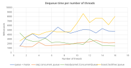

# Concurrent queue

The new container `seq::concurrent_queue` was added in *seq v2.1*. As its name implies, it is a concurrent (thread safe) FIFO (First In First Out) designed for Multi-Producer Multi-Consumer (MPMC) scenarios.

I tried several concurrent queue implementations but they all had their own limitations:
-	[moodycamel::ConcurrentQueue](https://github.com/cameron314/concurrentqueue): very fast for pushing, but no guarantee on the dequeuing order which is a big stop for me.
-	[boost::lockfree::queue](https://www.boost.org/doc/libs/1_53_0/doc/html/lockfree.html): I did not manage to get any performances out of it, maybe I configured it wrongly. But the type limitation is also a big no.
-	[MPMCQueue](https://github.com/rigtorp/MPMCQueue): very good one, but sadly only work with preallocated storage.

In the end I decided to roll my own implentation with the following criteria:
-	Being faster than a regular std::mutex plus std::deque,
-	Having the possibility to preallocate memory up-front,
-	Always ensure FIFO behavior,
-	Not being to harsh on the type requirement,
-	Providing unsafe but usefull API (like iteration)

The resulting `seq::concurrent_queue` is not fully lock-free nor wait-free, but combines atomic-based operations with locks to provide a certain level of concurrency.

Below image is a simple benchmark of multiple concurrent queue implementations: [moodycamel::ConcurrentQueue](https://github.com/cameron314/concurrentqueue), [boost::lockfree::queue](https://www.boost.org/doc/libs/1_53_0/doc/html/lockfree.html), `seq::concurrent_queue` and a simple queue + mutex.
In this benchmark, N threads continuously push new values while N threads continuously try to dequeue elements. We stop the process when 10M elements have been successfully dequeued and measure the time it took (lower is better).
In order to simulate a real steady-state MPMC scenario, the dequeuing threads sleep 10ms each time the dequeue operation fails in order to give some room to the pushing threads for adding new values.
The benchmark ran on a Linux server equipped with 2 *Intel(R) Xeon(R) Gold 5220R CPU @ 2.20GHz* of 24 CPU cores each.

 
`seq::concurrent_queue` performs really well and only start to get outpaced by `moodycamel::ConcurrentQueue` with 10 producer threads and 10 consumer threads. The choice between the 2 implementations really depend of your need regarding the dequeuing order.

