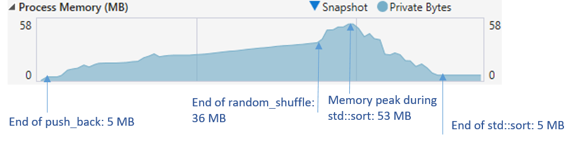

# Compressed std::vector like container

`seq::cvector` is a is a random-access container with an interface similar to `std::vector` but storing its element in a compressed way. 
Its goal is to reduce the memory footprint of the container while providing performances as close as possible to `std::vector`. 


## Internals

By default, `cvector` stores its elements by chunks of 256 values. Whenever a chunk is filled (due for instance to calls to push_back()), it is compressed
and the chunk itself is either kept internally (for further decompression) or deallocated. This means that `cvector` NEVER ensure reference stability,
as a stored object might only exist in its compressed form.

When accessing a value using iterators or operator[], the corresponding chunk is first located. If this chunk was already decompressed, a reference wrapper
to the corresponding element is returned. Otherwise, the memory chunk is decompressed first. If the accessed element is modified, the chunk is mark as dirty,
meaning that it will require recompression at some point.

To avoid compressing/decompressing lots of chunks when performing heavy random-access operations, `cvector` allows multiple chunks to store their elements
in their decompressed form, called **decompression contexts**. The maximum number of decompression contexts is defined using
`cvector::set_max_contexts()`, and is either a fixed number or a fraction of the total number of chunks. By default, the number of decompression contexts is
limited to 12.5% of the number of chunks. This means that the `cvector` memory footprint is at most 1.125 times higher than `cvector::size()*sizeof(value_type)`.

Whenever a chunk must be decompressed to access one of its element, it allocates a new decompression context if the maximum number of allowed contexts has not been
reach yet, and this context is added to an internal list of all available contexts. Otherwise, it try to reuse an existing decompression context 
from this internal list. Note that the chunk might reuse a context already used by another chunk. In this case, this other chunk is recompressed if marked dirty, 
the context is detached from this chunk and attached to the new one which decompress its elements inside. This means that accessing an element 
(even with const members) might invalidate any other reference to elements within the container. 
 

## Element access

Individual elements can be accessed using `cvector::operator[]`, `cvector::at`, `cvector::front`, `cvector::back` or iterators. As seen in previous section, accessing
an element might invalidate all other references to the container elements (in fact, it might invalidate all elements that do not belong to the corresponding chunk).

That's why access members return a reference wrapper instead of a plain reference (types `cvector::ref_type` and `cvector::const_ref_type`). A reference wrapper basically
stores a pointer to `cvector` internal data and the coordinate of the corresponding element. When casting this wrapper to **value_type**, the corresponding chunk is
decompressed (if needed) and the value at given location is returned. A reference wrapper can be casted to **value_type** or **const value_type&**, in which case the 
reference should not be used after accessing another element.

Example:

```cpp

// Fill cvector
seq::cvector<int> vec;
for(int i=0; i < 1000; ++i)
		vec.push_back(i);

// a is of type cvector<int>::ref_type
auto a = vec[0];

// copy element pointed by a to b
int b = a;

// Store a const reference of element 0
const int & c = vec[0];

// WARNING: accessing element at position 600 might invalidate reference c!
const int & d = vec[600];

``` 

In order for cvector to work with all STL algorithms, some latitudes with C++ standard were taken:
-	`std::swap` is overloaded for reference wrapper types. Overloading `std::swap` is forbidden by the standard, but works in practive with msvc and gcc at least.
-	`std::move` is overloaded for reference wrapper types. This was mandatory for algorithms like `std::move(first,last,dst)` to work on move-only types.

Thanks to this, it is possible to call `std::sort` or std::random_shuffle on a `cvector`. For instance, the following code snippet successively:
-	Call `cvector::push_back` to fill the cvector with sorted data. In this case the compression ratio is very low due to high values correlation.
-	Call `std::random_shuffle` to shuffle the cvector: the compresion ratio becomes very high as compressing random data is basically impossible.
-	Sort again the cvector with `std::sort` to get back the initial compression ratio.

```cpp

#include <seq/cvector.hpp>

// for seq::random_shuffle
#include <seq/utils.hpp>

// for tick() and tock_ms()
#include <seq/testing.hpp>

#include <iostream>

//...

using namespace seq;
///
cvector<int> w;

// fill with consecutive values
for (size_t i = 0; i < 10000000; ++i)
	w.push_back((int)i);

std::cout << "push_back: " << w.current_compression_ratio() << std::endl;

// shuffle the cvector
tick();
seq::random_shuffle(w.begin(), w.end());
size_t el = tock_ms();
std::cout << "random_shuffle: " << w.current_compression_ratio() << " in " << el << " ms" << std::endl;

// sort the cvector
tick();
std::sort(w.begin(), w.end());
el = tock_ms();
std::cout << "sort: " << w.current_compression_ratio() << " in " << el << " ms" << std::endl;

``` 

Below is a curve representing the program memory footprint during previous operations (extracted with Visual Studio diagnostic tools):



## Restrictions

cvector only works with relocatable value types (relocation in terms of move plus destroy).
`seq::is_relocatable` type trait will be used to detect invalid data types. You can specialize `seq::is_relocatable` for your custom
types if you are certain they are indeed relocatable.


## Compression algorithm

In order for cvector to have any interset over a standard `std::vector` or `std::deque`, its compression algorithm must be:
-	very fast or the performance gap will be to high compared to STL counterparts,
-	symetric if possible, as compression is performed almost as often as decompression,
-	efficient on small blocks of data to allow fast random access.

It turns out I developed a compression algorithm a while back for lossless image compression that worked on small blocks of 16*16 pixels. I just had
to adjust it to work on flat input and blocks of 256 elements. This algorithm relies on well known compression methods: it uses bit packing, delta coding
and RLE (whichever is better) on the transposed block. All of this is performed using SSE3 (at least), but is faster if SSE4.1 is available, and even faster with AVX2.
Both compression and decompression run at more or less 2GB/s  on a my laptop (Intel(R) Core(TM) i7-10850H CPU @ 2.70GHz).

If compared to other compression methods working on transposed input like <a href="https://www.blosc.org/">blosc</a> with <a href="https://github.com/lz4/lz4">LZ4</a>, my compression algorithm
provides slighly lower values: it is slower and compress less by a small margin. However, it is way more efficient on small blocks (256 elements in this case)
as it keeps its full strength: indeed, each block is compressed independently.
	
The compression algorithm supports an acceleration factor ranging from 0 (maximum compression) to 7 (fastest). It mainly changes the way near-uncompressible 
blocks are handled. The acceleration factor is given as a template parameter of cvector class.

It is possible to specify a different compression method using the **Encoder** template argument of cvector. For instance one can use the `seq::detail::NullEncoder`
that encode/decode blocks using... memcpy (transforming cvector to a poor deque-like class). For custom encoder, it is possible to specify a different block size 
instead of the default 256 elements (it must remain a power of 2). Note that increasing the block size might increase the compression ratio and bidirectional access patterns,
but will slow down random-access patterns.

seq library provides `seq::Lz4FlatEncoder` and `seq::Lz4TransposeEncoder` (in `internal/lz4small.h`) as example of custom encoders that can be passed to cvector.
They rely on a modified version of LZ4 compression algorithm suitable for small input length. `seq::Lz4FlatEncoder` is sometimes better than the default block encoder 
for cvector of seq::tiny_string.


## Multithreading

By default, cvector does not support multi-threaded access, even on read-only mode. Indeed, retrieving an element might trigger a block decompression, which in
turn might trigger a recompression of another block in order to steal its decompression context.

cvector supports a locking mechanism at the block level for concurrent accesses. Below is a commented example of several ways to apply `std::cos` function
to all elements of a cvector, including multi-threading based on openmp and use of the low level block API.

```cpp

#include <seq/cvector.hpp>

// for tick() and tock_ms()
#include <seq/testing.hpp>

#include <vector>
#include <cstdlib>
#include <algorithm>
#include <iostream>

using namespace seq;


int  main  (int , char** )
{

	// Create 10000000 random float values
std::srand(0);
std::vector<float>  random_vals(10000000);
for (float& v : random_vals)
		v = std::rand();

// fill a cvector with random values
cvector<float> vec;
for (float v : random_vals)
		vec.push_back(v);


// Standard loop over all values using operator[]
tick();
for (size_t i = 0; i < vec.size(); ++i)
{
	vec[i] = std::cos((float)vec[i]);
}
size_t el = tock_ms();
std::cout << "operator[]: " << el << " ms" << std::endl;


// reset values
std::copy(random_vals.begin(), random_vals.end(), vec.begin());


// Standard loop over all values using iterators
tick();
for (auto it = vec.begin(); it != vec.end(); ++it)
{
	*it = std::cos((float)*it);
}
el = tock_ms();
std::cout << "iterator: " << el << " ms" << std::endl;


//reset values
std::copy(random_vals.begin(), random_vals.end(), vec.begin());


// Use cvector::for_each (mono threaded, but supports concurrent access).
// This should be as fast as working on a std::vector directly.
tick();
vec.for_each(0, vec.size(), [](float& v) {v = std::cos(v); });
el = tock_ms();
std::cout << "cvector::for_each: " << el << " ms" << std::endl;


//reset values
std::copy(random_vals.begin(), random_vals.end(), vec.begin());


// Multithreaded loop
tick();
#pragma omp parallel for
for (int i = 0; i < (int)vec.size(); ++i)
{
	// lock position i since we multithreaded the loop
	auto lock_guard = vec.lock(i);
	vec[i] = std::cos((float)vec[i]);
}
el = tock_ms();
std::cout << "operator[] multithreaded: " << el << " ms" << std::endl;


//reset values
std::copy(random_vals.begin(), random_vals.end(), vec.begin());


// Parallel loop over blocks instead of values, using cvector block API
tick();
#pragma omp parallel for
// loop over all blocks
for (int i = 0; i < (int)vec.block_count(); ++i)
{
	// lock block since we multithreaded the loop
	auto lock_guard = vec.lock_block(i);

	// retrieve the block as a std::pair<float*, unsigned> (data pointer, block size)
	auto bl = vec.block(i);

	// apply std::cos functions on all elements of the block
	for (unsigned j = 0; j < bl.second; ++j)
		bl.first[j] = std::cos(bl.first[j]);

	// manually mark the block as dirty (need recompression at some point)
	vec.mark_dirty_block(i);
}
el = tock_ms();
std::cout << "block API multithreaded: " << el << " ms" << std::endl;


return 0;
}

```


Above example compiled with gcc 10.1.0 (-O3) for msys2 on Windows 10 on a Intel(R) Core(TM) i7-10850H at 2.70GHz gives the following output:

> operator[]: 454 ms
>
> iterator: 444 ms
>
> cvector::for_each : 418 ms
>
> operator[] multithreaded : 179 ms
>
> block API multithreaded : 59 ms


## Serialization

cvector provides serialization/deserialization functions working on compressed blocks. Use `cvector::serialize` to save the cvector content in
a `std::ostream` object, and `cvector::deserialize` to read back the cvector from a `std::istream` object. When deserializing a cvector object with
cvector::deserialize, the cvector template parameters must be the same as the ones used for serialization, except for the **Acceleration** parameter and the allocator type.

Example:

```cpp

#include <seq/cvector.hpp>

#include <string>
#include <iostream>
#include <vector>
#include <sstream>
#include <algorithm>

using namespace seq;


int  main  (int , char** )
{

	// Create values we want to serialize
	std::vector<int> content(10000000);
	for (size_t i = 0; i < content.size(); ++i)
		content[i] = i;


	std::string saved;
	{
		// Create a cvector, fill it
		cvector<int> vec;
		std::copy(content.begin(), content.end(), std::back_inserter(vec));

		// Save cvector in 'saved' string
		std::ostringstream oss;
		vec.serialize(oss);
		saved = oss.str();

		// print the compression ratio based on 'saved'
		std::cout << "serialize compression ratio: " << saved.size() / (double)(sizeof(int) * vec.size()) << std::endl;
	}

	// Deserialize 'saved' string
	std::istringstream iss(saved);
	cvector<int> vec;
	vec.deserialize(iss);

	// Make sure the deserialized cvector is equal to the original vector
	std::cout << "deserialization valid: " << std::equal(vec.begin(), vec.end(), content.begin(), content.end()) << std::endl;

	return 0;
}

```


## Custom comparison

When using a custom comparator function with STL algorithms like `std::sort` or `std::equal` on cvector, there are chances that the algorithm won't work as expected or just crash.
This is because 2 reference wrappers might be casted at the same time to real value_type references, that then will be passed to the custom comparator.
However, since accessing a cvector value might invalidate all other references, the custom comparator might be applied on dangling objects.  
To avoid this error, you must use a comparator wrapper that will smoothly handle such situations using seq::make_comparator.
Example:

```cpp

#include <seq/cvector.hpp>

#include <algorithm>
#include <memory>
#include <iostream>
#include <cstdlib>

using namespace seq;


int  main  (int , char** )
{
	using ptr_type = std::unique_ptr<size_t>;

	// Create a cvector of unique_ptr with random integers
	cvector<ptr_type> vec;
	std::srand(0);
	for(size_t i = 0; i < 1000000; ++i)
		vec.emplace_back(new size_t(std::rand()));

	// print the compression ratio
	std::cout<< vec.current_compression_ratio() <<std::endl;

	// sort the cvector using the defined comparison operator between 2 std::unique_ptr objects (sort by pointer address)
	std::sort(vec.begin(),vec.end());

	// print again the compression ratio
	std::cout<< vec.current_compression_ratio() <<std::endl;

	// Now we want to sort by pointed value. 
	// We need a custom comparison function that will be passed to seq::make_comparator
	
	std::sort(vec.begin(),vec.end(), make_comparator([](const ptr_type & a, const ptr_type & b){return *a < *b; }));

	// print again the compression ratio
	std::cout<< vec.current_compression_ratio() <<std::endl;

	return 0;
}

```


## Heterogeneous container

cvector works with [seq::hold_any](any.md) to provide heterogeneous compressed vector. However it only works with `seq::r_any` instead of `seq::any` as it requires a relocatable type.
Example:

```cpp

#include "cvector.hpp"
#include "any.hpp"
#include "testing.hpp"

#include <algorithm>
#include <iostream>
#include <cstdlib>

using namespace seq;


int  main  (int , char** )
{
	// Construct a cvector of r_any filled with various values of type size_t, double, std::string or tstring.
	seq::cvector<seq::r_any> vec;
	for (size_t i = 0; i < 100000; ++i)
	{
		size_t idx = i & 3U;
		switch (idx) {
		case 0: vec.push_back(seq::r_any(i * UINT64_C(0xc4ceb9fe1a85ec53)));
		case 1: vec.push_back(seq::r_any((double)(i * UINT64_C(0xc4ceb9fe1a85ec53))));
		case 2: vec.push_back(seq::r_any(generate_random_string<std::string>(14, true)));
		default: vec.push_back(seq::r_any(generate_random_string<tstring>(14, true)));
	}

	// Print the compression ratio
	std::cout << vec.current_compression_ratio() << std::endl;
	
	// Sort the heterogeneous container (see hold_any documentation for more details on its comparison operators)
	std::sort(vec.begin(), vec.end());

	// Print the compression ratio
	std::cout << vec.current_compression_ratio() << std::endl;
	
	// Ensure the container is well sorted
	std::cout << std::is_sorted(vec.begin(), vec.end()) << std::endl;

	return 0;
}

\endcode

```


## Text compression

The default block compressor provided with cvector works great for arbitrary structures, but compresses poorly raw ascii text.
Using a `seq::cvector<char>` in order to compress raw text is a bad idea as the resulting compression ratio will be very low.
Instead, you should use the provided `Lz4FlatEncoder` (or provide your own encoder) with a bigger block size.

Example:

```cpp

#include <seq/cvector.hpp>
#include <seq/internal/lz4small.h>

#include <fstream>
#include <iostream>

using namespace seq;

int  main  (int , char** )
{
	std::ifstream fin("my_text_file.txt");
	
	// create a cvector of char and fill it with provided file's content
	cvector<char, std::allocator<char>, 0, seq::Lz4FlatEncoder, 2048> vec;(
		std::istreambuf_iterator<char>(fin),
		std::istreambuf_iterator<char>());

	std::cout <<vec.size() << " "<< vec.current_compression_ratio() << std::endl;
	return 0;
}
```