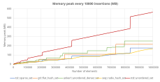
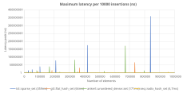
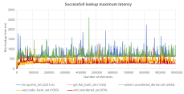

# Hash table latency benchmark

A lot of exhaustive hash table benchmarks can be found online, like for instance:
-	From [jacksonallan](https://jacksonallan.github.io/c_cpp_hash_tables_benchmark/)
-	From [Tessil](https://tessil.github.io/2016/08/29/benchmark-hopscotch-map.html)
-	From [Martin Ankerl](https://martin.ankerl.com/2022/08/27/hashmap-bench-01/)
-	From [skarupke](https://attractivechaos.wordpress.com/2018/01/13/revisiting-hash-table-performance/)
-	From [renzibei](https://github.com/renzibei/hashtable-bench)

In fact, every time a new hash table appear, a new benchmark is provided as well. I love these benchmarks, so let me follow the tradition and provide my own. Except that this time we're going to focus on slightly ignored metrics:
-	The memory peak of several hast table implementations (this measure can be found on some benchmarks)
-	The latency (maximum time to insert or find a value) which is mostly ignored.

The goal here is to show the performances of the `seq::radix_hash_set/map` in this regard, which is based on the [Variable Arity Radix Tree](radix_tree.md) (VART), a concept of my own derived from the *Burst Trie*.
We do not compare ALL possible implementations in this benchmark, only a few hash tables (all great in their own regard) representing very different storage/probing strategies:
-	[tsl::sparse_set](https://github.com/Tessil/sparse-map): low memory hash table (similar to `google::sparse_hash_set`) using quadratic probing,
-	[gtl::flat_hash_set](https://github.com/greg7mdp/gtl): swiss table derived from  `absl::flat_hash_set` using quadratic probing,
-	[ankerl::unordered_dense::set](https://github.com/martinus/unordered_dense): double storage strategy using robin hood probing,
-	`std::unordered_set`: the standard C++ hash table using chaining. We use the msvc implementation which is quite performant considering its requirements (and compared to libstdc++ one),
-	[seq::radix_hash_set](radix_tree.md): *seq* library hash table based on VART and using incremental rehash.

As far as I know, all hash tables use a factor of 2 growth policy.

All benchmarks ran on an *Intel(R) Core(TM) i7-10850H* at 2.70GHz and were compiled with msvc 19.44.35219.

## Memory peak benchmark

The first benchmark measures the memory peak of each hash table based on the number of elements it contains. For that we insert 10M integers of 64 bits in each table using `seq::hasher` hash function. 
Every 10000 insertions, the program memory peak is recorded. Therefore, we do NOT see the release of memory happening at the end of rehash, which is Ok since we are only interested in the memory peak.
The following graph shows the memory peak in MB based on the number of inserted values for each hash table.

All implementations have a distinctive behavior:
-	`std::unordered_set` is as expected the most memory hungry. Its memory usage pattern is composed of a peak during rehash, followed by a linear pattern due to the multitude of small allocations (one per entry).
-	`gtl::flat_hash_set` behaves like a *regular* open-addressing hash table, with a single memory peak at each rehash.
-	`ankerl::unordered_dense::set` displays multiple memory peaks as it uses a double storage strategy: one for the hash table (element index + probe distance) and one for the values (regular std::vector). Both storage double their capacities at different times.
-	`tsl::sparse_set` displays tiny memory peaks (when the bucket table is effectively doubled) followed by a linear pattern (when each bucket receive new values).
-	`seq::radix_hash_set` has a very low, almost linear memory pattern. This is thanks to it incremental rehash strategy as explained [here](radix_tree.md).

Now, let's see if the memory usage is correlated to the insertion latency.

## Insertion latency benchmark

The goal here is to measure the MAXIMUM time required for an insertion. This measure is usefull for low latency systems, where the hash table maximum size cannot be predicted up-front.
For that, we insert 10M values within the hash table and measure the each individual insertion time using the most precise possible measurement method (QueryPerformanceCounter on Windows).
For this benchmark, the measure precision is not an issue as we expect high values during rehash. The following graph displays the maximum insertion latency in nanoseconds based on the number of elements. The maximum latency is displayed in the legend.
I removed the `std::unordered_set` curve which is too high and makes it impossible to interpret the results (and log scale does not help either). Just know that it's roughly 2 times slower than the second slowest (`tsl::sparse_set`).

Measurements are coherant whith the memory patterns:
-	`gtl::flat_hash_set` is rather fast to rehash, but still needs 66ms to insert a single value at most.
-	`ankerl::unordered_dense::set` rehash process is slightly slower, as robin hood insertion process might require to move around several elements. We also see secondary peaks corresponding to the vector resize.
-	`tsl::sparse_set` rehash process is... slow. No wonder as it requires a lot of small allocations/deallocations, that's the price of a small memory usage. If you're unlucky, a single insertion in a big table might take more than... 300ms.
-	`seq::radix_hash_set` has a very low latency compared to other implementations. Its biggest insertion time (4.7ms) is 10 times lower than the second fastest (`gtl::flat_hash_set`).

So far so good, we see that `seq::radix_hash_set` manage to combine very low memory usage with low insertion latency. But this is also the case for a regular `std::map`... that we usually don't want to use for single point lookup.
To be complete, we also need to measure the latency of successfull and failed lookup operations.

## Lookup latency benchmark

In this benchmark, we want to knwow the maximum time taken by a single `find()` operation, weither successfull or not.
The process is slightly different than with previous benchmark: 
-	We insert 10M elements to a hash table,
-	Every 10k elements, we measure the time it takes to look for 100 random existing values and compute the average time. We cannot just measure a single lookup which is way too fast for our measurement method.
-	Every 10k elements, we measure in the same way the average time to look for 100 random non existing values.

In the end failed lookup latencies are very similar to the successfull ones, therefore I just give the later:

First (good) news, all hash table behave in O(1) complexity. We already knew that, but it's still pleasing to the eyes. As for the interpretation:
-	`gtl::flat_hash_set` is rather fast with a low dispersion, like `seq::radix_hash_set`.
-	`ankerl::unordered_dense::set` and `tsl::sparse_set` have a higher average lookup time with a higher dispersion.
-	And the winner is... **std::unordered_set**!! This is the first benchmark I see with `std::unordered_set` on top (well, the good top).

These results contradict most other lookup benchmarks. Indded, `ankerl::unordered_dense::set` is usually very fast, while `std::unordered_set` not so much (although the msvc implementation is good for lookup).
I suspect that traditional benchmarks usually loop through all existing values in the hash table, which probably tends to highlight the cache locality differences between each implementation (even if the access pattern is random).
In this becnhmark, we only look for a few values in-between lots of insertions (that might slightly trash the cache). Therefore we probably are in a cold cache scenario that gives different results. Weither this scenario is more realistic or not depends on your use-case.

As a side note, we confirmed that `seq::radix_hash_set` has a low lookup latency in addition to low insertion latency and low memory footprint!