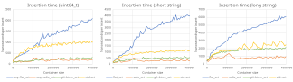
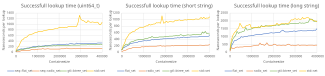

# Sorted containers benchmark

This document summarizes benchmark results between various sorted containers to demonstrate there differences in speed and complexity. The goal is mostly to place *seq* containers compared to other well known implementations. The following containers are tested:
-	`std::set`: this is the standard version of a sorted container, always a good idea to position ourself based on it. Its implementation is usually based on a Red-Black (RB) tree.
-	`[gtl::btree_set](https://github.com/greg7mdp/gtl)`: B-tree set derived from `[absl::btree_set](https://abseil.io/about/design/btree)`. Its internal nodes can store multiple values for usually better performances than a regular RB-tree. The number of stored values per node depends on the value type size.
-	`seq::flat_set`: flat set data structure within the *seq* library offering random access in addition to *standard* features. `seq::flat_set` is implemented on top of `seq::tiered_vector` for fast insertion/deletion of single element as opposed to most flat containers like `[boost::container::flat_set](https://www.boost.org/doc/libs/1_53_0/doc/html/boost/container/flat_set.html)`.
-	`seq::radix_set`: Radix tree using what I called Variable Arity Radix Tree ([VART](radix_tree.md)). I created this data structure based on the regular Burst Trie.

The benchmarks test 2 operations only: successfull insert and successfull lookup based on the number of entries in the container. For all tested containers, erasure and failed lookups are very similar to tested operations in terms of speed and are not displayed here.

Additional operations could have been tested, like iteration performances, failed insertion, range insertion, different input distributions... I might do it in the future, but my spare time is currently quite limited. Here are just a few hints based on internal benchmarks that I did not take the time to properly format:
-	`std::set` is the slowest in all tested scenarios for all operations. Indeed, its requirements (iterator/reference stability) require an allocation/deallocation for each insertion/deletion, and a lot of cache miss for lookup.
-	`seq::radix_set` is almost always the fastest in all tested scenarios, except for iteration where it is beaten by `seq::flat_set` which is as fast as a `std::deque`.
-	`seq::radix_set` is not comparison based, and can be slower than other containers with adverserial input distribution, like 'a', 'aa', 'aaa',... However, internal guardrails ensure that its performances remain comparable to `seq::flat_set` with an additional constant.
-	Both `gtl::btree_set` and `seq::flat_set` are very sensible to the value type size. In addition, `seq::flat_set` is MUCH faster for insertion/deletion with relocatable types (based on `seq::is_relocatable` type trait). For large value type size, `gtl::btree_set` behaves exactly like `std::set`.
-	`seq::radix_set` and `seq::flat_set` are both faster when using range insertion.

## Successfull insertion benchmark

The following graphs show the average insertion time (one by one) in nanoseconds based on the container current size (lower is better) for 3 different value types:
-	random 64 bits integer,
-	random short ascii `[seq::tstring](tiny_string.md)` of 15 characters (using Small String Optimization),
-	random long ascii string of 64 characters (each requiring an allocation).

A few things can be said:
-	`seq::radix_set` is always the fastest. Its insertion complexity is always in-between O(1) for random input, up to O(sqrt(N)) for adverserial input (similar to `seq::flat_set`) and unlike most radix trees that perform in O(k) (k is the input length).
-	`seq::flat_set` quickly become the slowest container with its O(sqrt(N)) complexity. However, for 8 bytes value, it remains faster than `std::set` until 1M values, which is impressive for a flat map (as compared to boost::flat_set for instance). 
-	For long strings, finding the insertion location will trigger several cache misses on most containers. `seq::radix_set` is way faster as it mostly only use the inserted value itself to build its internal insertion path.

## Successfull lookup benchmark

The following graphs show the average successfull lookup time in nanoseconds based on the container current size (lower is better) for 3 different value types:
-	random 64 bits integer,
-	random short ascii `seq::tstring` of 15 characters (using Small String Optimization),
-	random long ascii string of 64 characters (each requiring an allocation).

Results here are slightly different than for the insertion benchmark, and we clearly see the O(log(N)) asymptotic complexity for most containers. Some remarks:
-	For random input of fixed length size (which is the case here as the strings are bounded), `seq::radix_set` has a complexity of O(1) as almost each input creates a unique lookup path. In fact, for truely random integers, `seq::radix_set` behaves almost exactly like a hash table. Its worst complexity (with adverserial input) is always O(log(N)) as it degenerate to a flat map with an additional constant time.
-	`seq::flat_map` performs in O(log(N)) as it uses a kind of binary search internally, like most flat map implementations. It is very close to `gtl::btree_set` in performances, and will outpace it for bigger value type size.

